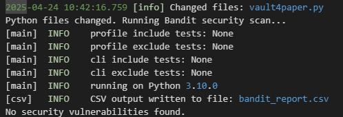
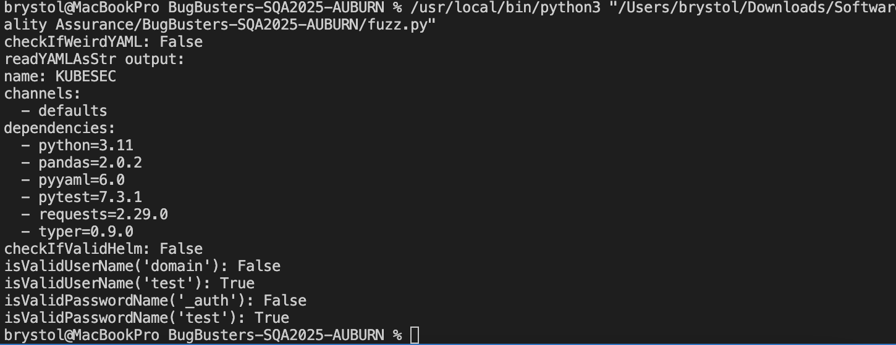
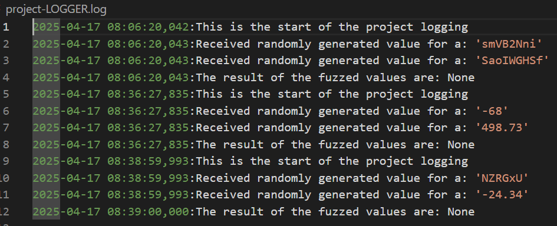

# BugBusters-SQA2025-AUBURN
## Software Quality Assurance Group Project Report

- **Brystol Metcalf**  **Jack Bianca**  **Addison Barrow**  **Jonathan Turnage**
# 04/26/25

1. Security Weaknesses -
A pre-commit hook was created to run bandit on all python files in the repository in an attempt to detect vulnerabilities. It is located in the .git/hooks hidden folder. This hook generates the bandit_report.csv file to record any findings. Below is an example console output and some outputs from the bandit report:

'''
filename,test_name,test_id,issue_severity,issue_confidence,issue_cwe,issue_text,line_number,col_offset,end_col_offset,line_range,more_info

.\KubeSec-master\TEST_CONSTANTS.py,hardcoded_password_string,B105,LOW,MEDIUM,https://cwe.mitre.org/data/definitions/259.html,Possible hardcoded password: 'TEST_ARTIFACTS/helm.values.yaml',8,22,55,[8],https://bandit.readthedocs.io/en/1.8.2/plugins/b105_hardcoded_password_string.html

.\KubeSec-master\TEST_CONSTANTS.py,hardcoded_password_string,B105,LOW,MEDIUM,https://cwe.mitre.org/data/definitions/259.html,Possible hardcoded password: 'TEST_ARTIFACTS/tango.values.yaml',9,22,56,[9],https://bandit.readthedocs.io/en/1.8.2/plugins/b105_hardcoded_password_string.html
'''

2. Fuzzing and Static Analysis - Five methods are fuzzed in fuzz.py. The lessons learned from each are as follows:

In terms of static analysis, we used this to help identify potential input related issues, like incorrect data types (non string inputs)

1) checkIfWeirdYAML - We learned to add input checks to ensure the input is a string before processing.

2) readYAMLAsStr - We learned to validate the file path and ensure it is a valid string before attempting to read.

3) checkIfValidHelm - We learned to add input validation and ensure the path is a valid string and Helm configuration is properly checked.

4) isValidUserName - We learned to check for forbidden username patterns before processing.

5) isValidPasswordName - We learned to add input checks to ensure the password name is a valid string and handle forbidden password patterns appropriately.

Below is an example output of fuzz.py where inputted usernames and passwords do not pass:

3. Forensics -
Logging has been added to the same five python methods that were fuzzed. This logging includes the start of when the method is provoked as well as the args used, and if the method fails, the error it encounters.
Below is an screenshot of the logs:

4. Lessons Learned -
In each activity, we learned how to detect vulnerabilities or made it easier to diagnose them. Developing these tools and integrating them into every work that we do, helps to build more resilient and secure code.
